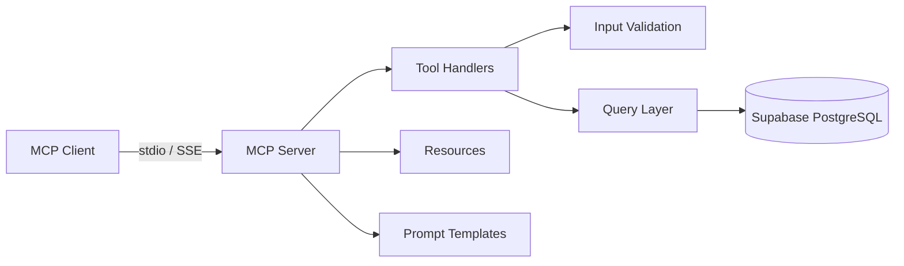

# MCP Financial Server

A Model Context Protocol (MCP) server that exposes financial data tools over a Supabase PostgreSQL database. Query company profiles, financial reports, stock prices, analyst ratings, and more — all accessible from any MCP-compatible client like Claude Desktop or Cursor.

## Architecture



**Key components:**

- **Transport layer** — stdio (default) for local use, SSE for remote/web access
- **8 financial tools** — parameterized queries with Pydantic validation
- **MCP Resources** — browse company data directly
- **Prompt Templates** — pre-built analysis and comparison prompts
- **Rate limiting** — sliding window limiter on SSE transport (60 req/min)

## Tools

| Tool | Description |
|------|-------------|
| `get_company_profile` | Look up a company by ticker or name |
| `search_companies` | Search by sector, industry, market cap, country |
| `get_financial_report` | Quarterly/annual financial reports |
| `compare_companies` | Side-by-side comparison of 2-5 companies |
| `get_stock_price_history` | Historical OHLCV price data |
| `get_analyst_ratings` | Analyst ratings with consensus summary |
| `screen_stocks` | Screen by revenue, EPS, margins, debt ratio |
| `get_sector_overview` | Sector-level aggregated metrics |

## Setup

### Prerequisites

- Python 3.10+
- A [Supabase](https://supabase.com) project (free tier works)

### 1. Clone and install

```bash
git clone https://github.com/<your-user>/mcp-financial-server.git
cd mcp-financial-server
python -m venv .venv
source .venv/bin/activate
pip install -e ".[dev]"
```

### 2. Configure environment

```bash
cp .env.example .env
# Edit .env with your Supabase credentials
```

### 3. Set up the database

Run the schema in your Supabase SQL editor:

```bash
# Copy contents of database/schema.sql into Supabase SQL Editor and run
# Then run database/seed.sql to populate with sample data
```

Or use the seed script:

```bash
python database/seed_script.py
```

### 4. Run the server

**stdio mode** (for Claude Desktop / Cursor):

```bash
python -m src.server
```

**SSE mode** (for remote/web clients):

```bash
python -m src.server --sse
# Server starts on http://127.0.0.1:8000
```

## Environment Variables

| Variable | Required | Description |
|----------|----------|-------------|
| `SUPABASE_URL` | Yes | Your Supabase project URL |
| `SUPABASE_ANON_KEY` | Yes | Supabase anonymous/public key |
| `SUPABASE_SERVICE_ROLE_KEY` | Yes | Supabase service role key (full DB access) |
| `DATABASE_URL` | No | Direct PostgreSQL connection string |
| `SERVER_PORT` | No | SSE server port (default: 8080) |

## Example Tool Calls

### Get a company profile

```json
{
  "tool": "get_company_profile",
  "arguments": { "identifier": "AAPL" }
}
```

Response:
```json
{
  "status": "success",
  "data": {
    "ticker": "AAPL",
    "name": "Apple Inc.",
    "sector": "Technology",
    "market_cap": 3200000000000,
    "ceo": "Tim Cook",
    "employees": 164000
  }
}
```

### Compare companies

```json
{
  "tool": "compare_companies",
  "arguments": {
    "tickers": ["AAPL", "MSFT", "GOOGL"],
    "metrics": ["revenue", "eps", "gross_margin"]
  }
}
```

### Screen stocks

```json
{
  "tool": "screen_stocks",
  "arguments": {
    "min_eps": 3.0,
    "sector": "Technology"
  }
}
```

## Connecting with MCP Clients

### Claude Desktop

Add to your `claude_desktop_config.json`:

```json
{
  "mcpServers": {
    "financial-data": {
      "command": "python",
      "args": ["-m", "src.server"],
      "cwd": "/path/to/mcp-financial-server",
      "env": {
        "SUPABASE_URL": "your-url",
        "SUPABASE_ANON_KEY": "your-key",
        "SUPABASE_SERVICE_ROLE_KEY": "your-key"
      }
    }
  }
}
```

### Cursor

Add to your Cursor MCP settings:

```json
{
  "financial-data": {
    "command": "python",
    "args": ["-m", "src.server"],
    "cwd": "/path/to/mcp-financial-server"
  }
}
```

## MCP Resources

- `financial://companies` — List all companies with ticker, name, sector, market cap
- `financial://company/{ticker}` — Full company profile with latest financial report

## Prompt Templates

- **analyze_company** — Generates a comprehensive analysis prompt for any ticker
- **compare_companies** — Generates a side-by-side comparison prompt for two tickers

## Running Tests

```bash
pytest tests/ -v
```

## Project Structure

```
mcp-financial-server/
├── database/
│   ├── schema.sql          # PostgreSQL table definitions
│   ├── seed.sql            # Sample data (20 companies, 240 reports, etc.)
│   └── seed_script.py      # Python seed data generator
├── src/
│   ├── config/
│   │   └── env.py          # Environment validation
│   ├── db/
│   │   ├── client.py       # Supabase client singleton
│   │   └── queries.py      # Parameterized query functions
│   ├── middleware/
│   │   └── rate_limiter.py  # Sliding window rate limiter
│   ├── tools/               # Tool module (handlers in server.py)
│   ├── utils/
│   │   ├── errors.py       # Custom error classes
│   │   └── formatters.py   # Response formatting
│   ├── validators/
│   │   └── input_validator.py  # Pydantic schemas for all tools
│   └── server.py           # MCP server entry point
├── tests/
│   └── test_tools.py       # Unit tests (32 tests)
├── .env.example
└── pyproject.toml
```

## Data

The database contains sample data for 20 real companies:

AAPL, MSFT, GOOGL, AMZN, NVDA, META, TSLA, JPM, JNJ, V, PG, UNH, HD, MA, DIS, NFLX, ADBE, CRM, INTC, AMD

With:
- **240 financial reports** (quarterly, 2022-2024)
- **~1,260 stock price records** (90 trading days per company)
- **40-60 analyst ratings** (2-3 per company)
